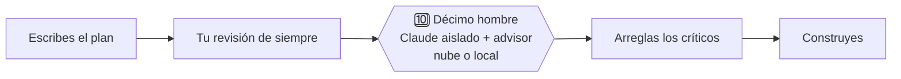

# 🔟 Décimo hombre · Tenth man

**Una skill de Claude Code que le manda tu plan a un revisor que no te conoce.**

[](LICENSE)
[](#instalar)
[](#instalar)
[](README.md)

*[Read in English](README.md)*

> Cuando nueve están de acuerdo, el décimo tiene la obligación de buscar por qué están equivocados.



## Por qué esta
Escribiste el plan, lo releíste y te gusta. Justo ahí está el problema: quien revisa después de haber vivido la misma conversación tiende a ver lo que tú ves, y a pasar por alto lo mismo que tú.

El décimo hombre le entrega tu documento a una sesión de Claude nueva, que no te conoce. Recibe el documento y un brief corto, nada más, y su único trabajo es encontrar dónde te equivocas.

| Sin ella | Con ella |
|---|---|
| El revisor leyó el mismo chat que escribió el plan | El revisor solo ve el documento y un brief |
| «Se ve bien» | Un veredicto, una tabla de hallazgos con gravedad, y qué se leyó y qué se infirió |
| La revisión se pierde en el historial | La revisión llega como `revision.md` en su propia rama, con un commit `LISTO:`/`BLOQUEADO:` |
| Pegar documentos internos en otra herramienta y cruzar los dedos | Un escaneo de datos personales y secretos que no sigue si no da cero |

## Instalar
En cualquier agente con skills ([Skills CLI](https://github.com/vercel-labs/skills)):
```bash
npx skills add vencx/decimo-hombre                 # las dos skills
npx skills add vencx/decimo-hombre --skill decimo-hombre
```
Como plugin de Claude Code:
```
/plugin marketplace add vencx/decimo-hombre
/plugin install decimo-hombre@decimo-hombre
```
Dos skills, el mismo motor: **`decimo-hombre`** (español) y **`tenth-man`** (inglés).

## Usar
Solo pídelo:
- *«décimo hombre a este plan: docs/plans/checkout-v2.md»*
- *«revisión adversaria del plan de migración antes de empezar, en local»*
- *«manda el RFC a revisión en la nube y trae los hallazgos junto a él»*

## Qué recibes
Una corrida real sobre un plan pequeño de recordatorios de citas ([ejemplo completo](examples/appointment-reminders/)):

> **Veredicto:** no está listo para construir. R2 y R3 no están garantizados por el diseño (no filtra las cancelaciones ni lee `recordada`). Sin cubrir: citas movidas, cron que se solapa o no corre, bordes de la ventana y zona horaria. La verificación solo prueba el caso feliz de R1.

Le sigue una tabla: hallazgo · sección · gravedad · propuesta. En un plan técnico real que el equipo había marcado «listo para implementar», encontró 4 críticos y unos 14 altos en unos 6 minutos.

## Cuándo usarla
Vale la pena cuando equivocarse sale caro de revertir (producción, dinero, datos de clientes, migraciones, agentes que hablan con clientes) y el documento ya existe.

| Flujo | Momento |
|---|---|
| [Compound Engineering](https://github.com/EveryInc/compound-engineering-plugin) | Siempre después de `/ce-plan`, tras tu revisión rápida y antes de `/ce-work` |
| [Superpowers](https://github.com/obra/superpowers) | Después de `writing-plans` y antes de `executing-plans` |
| Sin framework | Sobre el PRD, el RFC/ADR, el plan de migración, el system prompt de un agente o el runbook, antes de arrancar |

No es para cambios pequeños y reversibles, cazar bugs ni código ya escrito (para eso, una revisión de código).

## Cómo funciona
1. Copia solo el documento (más un brief escrito desde una plantilla: requisitos · técnico · diseño de agente) a una carpeta limpia con su propio git.
2. Lo escanea en busca de teléfonos, correos, IDs de chat y cadenas con pinta de clave, más tus propias regex. Si encuentra algo, se detiene.
3. Arranca una sesión de Claude aparte, pone primero `/advisor` (Fable por defecto) y luego manda el prompt.
4. Espera el artefacto (el commit), nunca el silencio.
5. Trae `revision.md` junto a tu plan.

## Nube o local
| | Nube | Local |
|---|---|---|
| Corre en | Claude Code web, repo privado en GitHub | Una sesión de `claude` aparte en tmux |
| Gasta | Tus créditos de sesiones en la nube | Tu cuota normal del plan |
| Sirve para | Revisiones largas mientras sigues trabajando | Sin GitHub, o copias que no deben salir de tu máquina |

¿Tienes créditos de la nube y no sabes en qué gastarlos? Aquí rinden. En nuestras corridas, cada revisión pequeña costó más o menos USD 2–3 de crédito (estimación nuestra, por el saldo antes y después).

## Límites, con honestidad
- En algunas configuraciones `claude --cloud` sube el repo como copia empaquetada: la revisión se hace, pero el push de vuelta da 403. La revisión sigue ahí: léela en la sesión o tráela con `claude --teleport <id>`. Al auditor se le pide no esquivar nunca un 403.
- Revisa documentos, no diffs de código.
- Una revisión por documento: requisitos y plan técnico son dos revisiones.

## Requisitos
Claude Code con `/advisor`, `tmux`, `git`, `python3`. Para la nube, además `gh` con sesión iniciada, Claude Code web e idealmente la GitHub App de Claude en tus repos.

Lo privado de cada usuario (dónde queda la revisión, a quién se avisa, regex extra de datos personales) va en `~/.claude/docs/decimo-hombre-anexo.md`, nunca en el plugin.

## Licencia
MIT
