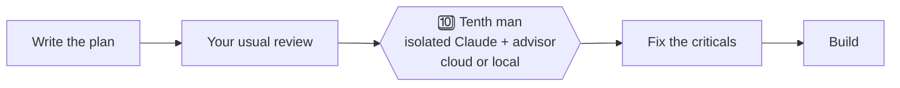

# 🔟 Tenth man · Décimo hombre

**A Claude Code skill that sends your plan to a reviewer who has never met you.**

[](LICENSE)
[](#install)
[](#install)
[](README.es.md)

*[Leer en español](README.es.md)*

> When nine people agree, the tenth is obliged to look for why they are wrong.



## Why this one
You wrote the plan, you reread the plan, and you like the plan. That is exactly the problem: a reviewer who has been through the same conversation you have tends to see what you see, and miss what you miss.

Tenth man hands your document to a fresh Claude session that has never met you. It gets the document and a short brief, nothing else, and its only job is to find where you are wrong.

| Without it | With it |
|---|---|
| The reviewer read the same chat that wrote the plan | The reviewer only sees the document and a brief |
| "Looks good to me" | A verdict, a table of findings with severity, and what is read vs. inferred |
| Review lives in scrollback | Review lands as `review.md` on its own branch, closed by a `DONE:`/`BLOCKED:` commit |
| Pasting internal docs into another tool and hoping | A PII and secrets scan that refuses to continue unless it finds zero |

## Install
Any agent that supports skills ([Skills CLI](https://github.com/vercel-labs/skills)):
```bash
npx skills add vencx/decimo-hombre            # both skills
npx skills add vencx/decimo-hombre --skill tenth-man
```
As a Claude Code plugin:
```
/plugin marketplace add vencx/decimo-hombre
/plugin install decimo-hombre@decimo-hombre
```
Two skills, same engine: **`tenth-man`** (English) and **`decimo-hombre`** (Spanish).

## Use
Just ask:
- *"tenth-man this plan: docs/plans/checkout-v2.md"*
- *"red-team our migration plan before we start, run it locally"*
- *"send the RFC to cloud review and bring the findings back next to it"*

## What you get
A real run on a tiny appointment-reminder plan ([full example](examples/appointment-reminders/), in Spanish):

> **Verdict:** not ready to build. R2 and R3 are not guaranteed by the design (it never filters cancellations and never reads `reminded`). Uncovered: rescheduled appointments, overlapping or missed cron runs, window edges and time zones. The verification only tests the happy path of R1.

Followed by a table: finding · section · severity · proposal. On a real technical plan the team had marked "implementation-ready", it returned 4 critical and ~14 high findings in about 6 minutes.

## When to use it
Worth it when being wrong is expensive to undo (production, money, customer data, migrations, agents that talk to customers) and the document already exists.

| Workflow | Moment |
|---|---|
| [Compound Engineering](https://github.com/EveryInc/compound-engineering-plugin) | Always after `/ce-plan`, after your quick review, before `/ce-work` |
| [Superpowers](https://github.com/obra/superpowers) | After `writing-plans`, before `executing-plans` |
| No framework | On the PRD, RFC/ADR, migration plan, agent system prompt or runbook, before work starts |

Not for small reversible changes, bug hunts, or code already written (use a code review for that).

## How it works
1. Copies only the document (plus a brief written from a template: requirements · technical · agent design) into a clean folder with its own git repo.
2. Scans it for phone numbers, emails, chat IDs and key-like strings, plus your own regexes. Anything found stops the run.
3. Starts a separate Claude session, sets `/advisor` first (Fable by default), then sends the prompt.
4. Waits for the artifact (the commit), never for silence.
5. Brings `review.md` back next to your plan.

## Cloud or local
| | Cloud | Local |
|---|---|---|
| Runs on | Claude Code on the web, private GitHub repo | A separate `claude` session in tmux |
| Uses | Your cloud session credits | Your regular plan quota |
| Good for | Long reviews while you keep working | No GitHub, or copies that must not leave the machine |

Got cloud credits you do not know what to do with? This spends them on something useful. In our runs each small review cost roughly $2–3 of credit (our estimate, from the balance before and after).

## Honest limitations
- In some setups `claude --cloud` uploads the repo as a bundle; the review completes but the push back gets a 403. The review is still there: read it in the session or pull it with `claude --teleport <id>`. The auditor is told never to work around a 403.
- It reviews documents, not code diffs.
- One review per document: requirements and technical plan are two reviews.

## Requirements
Claude Code with `/advisor`, `tmux`, `git`, `python3`. For cloud mode also `gh` (logged in), Claude Code on the web, and ideally the Claude GitHub App on your repos.

Private per-user settings (where reviews land, who gets notified, extra PII regexes) go in `~/.claude/docs/tenth-man-annex.md`, never in the plugin.

## License
MIT
